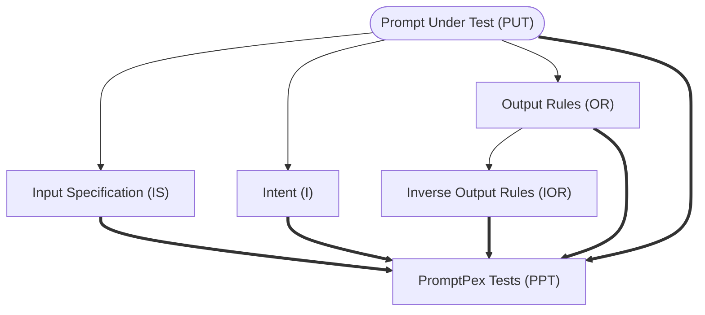

## GitHub Models extension

Use the GitHub Models service from the CLI!

This repository implements the GitHub Models CLI extension (`gh models`), enabling users to interact with AI models via the `gh` CLI. The extension supports inference, prompt evaluation, model listing, and test generation.

## Using

### Prerequisites

The extension requires the [`gh` CLI](https://cli.github.com/) to be installed and in the `PATH`. The extension also requires the user have authenticated via `gh auth`.

### Installing

After installing the `gh` CLI, from a command-line run:
```shell
gh extension install https://github.com/github/gh-models
```

#### Upgrading

If you've previously installed the `gh models` extension and want to update to the latest version, you can run this command:

```sh
gh extension upgrade github/gh-models
```

### Examples

#### Listing models

```shell
gh models list
```

Example output:
```shell
ID                              DISPLAY NAME
ai21-labs/ai21-jamba-1.5-large  AI21 Jamba 1.5 Large
openai/gpt-4.1                  OpenAI GPT-4.1
openai/gpt-4o-mini              OpenAI GPT-4o mini
cohere/cohere-command-r         Cohere Command R
deepseek/deepseek-v3-0324       Deepseek-V3-0324
```

Use the value in the "ID" column when specifying the model on the command-line.

#### Running inference

##### REPL mode

Run the extension in REPL mode. This will prompt you for which model to use.
```shell
gh models run
```

In REPL mode, use `/help` to list available commands. Otherwise just type your prompt and hit ENTER to send to the model.

##### Single-shot mode

Run the extension in single-shot mode. This will print the model output and exit.
```shell
gh models run openai/gpt-4o-mini "why is the sky blue?"
```

Run the extension with output from a command. This uses single-shot mode.
```shell
cat README.md | gh models run openai/gpt-4o-mini "summarize this text"
```

#### Evaluating prompts

Run evaluation tests against a model using a `.prompt.yml` file:
```shell
gh models eval my_prompt.prompt.yml
```

The evaluation will run test cases defined in the prompt file and display results in a human-readable format. For programmatic use, you can output results in JSON format:
```shell
gh models eval my_prompt.prompt.yml --json
```

The JSON output includes detailed test results, evaluation scores, and summary statistics that can be processed by other tools or CI/CD pipelines.

Here's a sample GitHub Action that uses the `eval` command to automatically run the evals in any PR that updates a prompt file: [evals_action.yml](/examples/evals_action.yml).

Learn more about `.prompt.yml` files here: [Storing prompts in GitHub repositories](https://docs.github.com/github-models/use-github-models/storing-prompts-in-github-repositories).

#### Generating tests

Generate comprehensive test cases for your prompts using the PromptPex methodology:
```shell
gh models generate my_prompt.prompt.yml
```

The `generate` command analyzes your prompt file and automatically creates test cases to evaluate the prompt's behavior across different scenarios and edge cases. This helps ensure your prompts are robust and perform as expected.

##### Understanding PromptPex

The `generate` command is based on [PromptPex](https://github.com/microsoft/promptpex), a Microsoft Research framework for systematic prompt testing. PromptPex follows a structured approach to generate comprehensive test cases by:

1. **Intent Analysis**: Understanding what the prompt is trying to achieve
2. **Input Specification**: Defining the expected input format and constraints
3. **Output Rules**: Establishing what constitutes correct output
4. **Inverse Output Rules**: Force generating _negated_ output rules to test the prompt with invalid inputs
5. **Test Generation**: Creating diverse test cases that cover various scenarios using the prompt, the intent, input specification and output rules



##### Advanced options

You can customize the test generation process with various options:

```shell
# Specify effort level (low, medium, high)
gh models generate --effort high my_prompt.prompt.yml

# Use a specific model for groundtruth generation
gh models generate --groundtruth-model "openai/gpt-4.1" my_prompt.prompt.yml

# Disable groundtruth generation
gh models generate --groundtruth-model "none" my_prompt.prompt.yml

# Load from an existing session file (or create a new one if needed)
gh models generate --session-file my_prompt.session.json my_prompt.prompt.yml

# Custom instructions for specific generation phases
gh models generate --instruction-intent "Focus on edge cases" my_prompt.prompt.yml
```

The `effort` flag controls a few flags in the test generation engine and is a tradeoff
between how much tests you want generated and how much tokens/time you are willing to spend.
- `low` should be used to do a quick try of the test generation. It limits the number of rules to `3`.
- `medium` provides much better coverage
- `high` spends more token per rule to generate tests, which typically leads to longer, more complex inputs

The command supports custom instructions for different phases of test generation:
- `--instruction-intent`: Custom system instruction for intent generation
- `--instruction-inputspec`: Custom system instruction for input specification generation  
- `--instruction-outputrules`: Custom system instruction for output rules generation
- `--instruction-inverseoutputrules`: Custom system instruction for inverse output rules generation
- `--instruction-tests`: Custom system instruction for tests generation


## Notice

Remember when interacting with a model you are experimenting with AI, so content mistakes are possible. The feature is
subject to various limits (including requests per minute, requests per day, tokens per request, and concurrent requests)
and is not designed for production use cases. GitHub Models uses
[Azure AI Content Safety](https://azure.microsoft.com/products/ai-services/ai-content-safety). These filters
cannot be turned off as part of the GitHub Models experience. If you decide to employ models through a paid service,
please configure your content filters to meet your requirements. This service is under
[GitHub's Pre-release Terms](https://docs.github.com/site-policy/github-terms/github-pre-release-license-terms). Your
use of the GitHub Models is subject to the following
[Product Terms](https://www.microsoft.com/licensing/terms/productoffering/MicrosoftAzure/allprograms) and
[Privacy Statement](https://www.microsoft.com/licensing/terms/product/PrivacyandSecurityTerms/MCA). Content within this
Repository may be subject to additional license terms.
